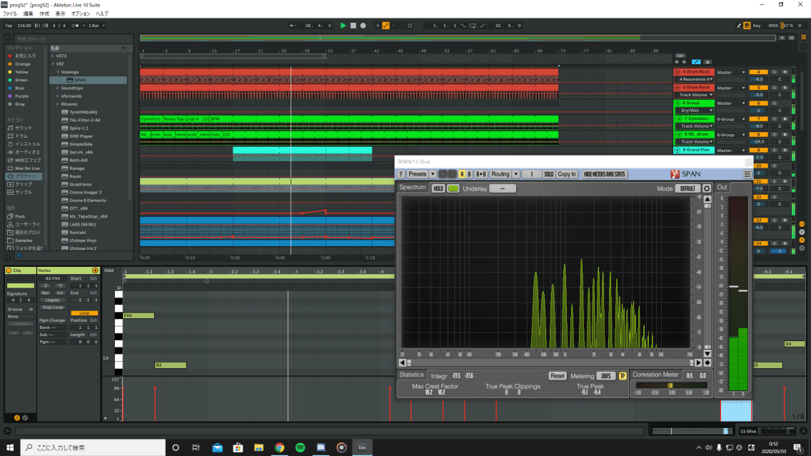

+++
authors = ["Beqqor"]
title = "[DAW] Ableton Liveについて"
date = "2020-04-25"
description = "Ableton Liveの紹介です。"
tags = [
    "DTM講座", "DAW", "DTM",
]
weight = 4
+++

## はじめに

このページでは， **Ableton Live** というDAWの詳細が記されています。

## Ableton Live

- [公式サイトはこちら](https://www.ableton.com/ja/live/)



**価格**

※Gradeで変わります

- Intro     11800円
- Standard  53800円
- Suite     90800円

**備考**

- 90日間Suiteを無料体験できます！
- 学割可能
- 5月20日まで30％OFF!(2020年現在)
- 

**対応OS**

- Windows 64-bit
- mac OS X 64-bit

## ユーザーの意見

### tomatoismさん
**Ableton Liveのいいところ**

  - ​​UIの無駄が無い
  - Simpler、Drumrackというサンプラー類がめちゃくちゃ強力
  - オートメーションの管理がしやすい
  - 初期エフェクター類のアクセスのしやすさがすごい
  - バスとセンドリターンが直感的
  - 大きなバグや問題が無い
  - Pushという専用コントローラーがある

**Ableton Liveのダメなところ**

  - 32bitプラグインが使えない
  - フェーダーの形が独特なので、慣れるのに2週間くらいかかった（コンソールビューに普通の縦フェーダーあります）
  - プラグインの管理にちょっと工夫が要る（ファルダ分けしたい場合dllファイルごと移動する必要がある）
  - UIのないプラグインは使えない（magical 8bit plugなど）  

### ご意見
　Abelton Liveの一番の特徴は **「追及された合理性」** だと思います。​​

UIはいわゆるフラットデザインで、フェーダーとか各種ボタンレイアウトが必要充分のサイズなので、シーケンス画面をのびのびと使うことが出来ます！

なかでも気に入っている部分は、初期エフェクター類のアクセスのしやすさで、 **わざわざクリックしてウィンドウを開かなくても直接すべての項目をいじれるようにコンパクトにデザインされています。** （画面を検索して見たほうが早いかも）

特に付属のDrumrackというサンプラープラグインは、ドラムとかFXとかごちゃごちゃしがちなワンショット類を全部ぶち込んで指定したMIDIノートで鳴らせるのでシーケンス画面がスリムになります。

たぶん他のDAWだとBatteryとかのサードパーティー製のものを使うしかないと思うんですが、かなり使用頻度が高いので軽くてアクセスしやすいDrumRackにはめちゃくちゃ助けられてます。

Simplerというワンショット特化のサンプラーも優秀です。サンプルにピッチをつけたい時などに重宝します。軽くて使いやすいやつは意外と少ない（というか無い）ので助かります。

　あと、皆口をそろえて言うのは **オートメーションの書きやすさと管理のしやすさ** です。もともと評判の良かったオートメーションですが、バージョン10からはショートカット[A]でオートメーションモード、通常モードを切り替えられるようになって完全に **神** になりました。**オーディオの流れが分かりやすい** のもLiveの特徴です。仕組みを理解してなくてもセンドリターンはバスと分離された概念として扱われているし、トラック用のフォルダーがバスの役割を果たすので、ビャーっと長いプルダウンの中からアウトプットするバスを選んで、、、とかやらなくていいので **直感的** です。僕みたいにCubaseの画面を見ただけで眩暈がする人にはお勧めです。

　かつてSonarとCubaseを使っていた時は制作に支障が出るレベルの本気で改善してほしい点がいくつもあったのですが、**Liveには「強いて言えば直してほしい」くらいの問題しかありません。** Liveを買っておけば、ほかのDAWに目移りすることはないと思います...。**スクリレックスも使ってます。**

付け加えて言えば、LiveにはPushという専用コントローラーがあります。DAWそのものに最適化されているのでNative InstrumentsのMaschineとかより深いところまで操作できます。とはいっても全然必須ではなくて、テクノやハウスとかのループする音楽やMPCみたいな機材使って曲作りたい人向けにはめちゃ良いのかなって感じです。あともし購入を考えている人は、最上位版のsuiteじゃなくて **Standardを買えば充分です**。

  　散文ですが何かの参考になれたら幸いです！ぼくなんかでよかったら質問答えますのでツイッター @tomatoismまでDMください！よろしくお願いいたします。よかったらフォローしてください！！



  [tomatoismさんのSoundCloud](https://soundcloud.com/tomatoism)

  [tomatoismさんのTwitter](https://twitter.com/tomatoism)

### ViT4Lさん

**Ableton Liveのいいところ**

  - サンプルエディタが非常に使いやすい。
  - 全体的なUIが非常にシンプルなのでプロジェクト全体が見やすい。
  - ループで曲を組んでいく感じが繰り返しの多いクラブミュージックとの相性が良い。
  - 付属音源及びエフェクターー等非常に優秀。
  - オートメーションが描きやすい
  ___

## 注釈

※記事内で多用されるものを再掲しております。

- プラグイン・・・DAWの上で動く様々なソフトのこと。
- サンプラー・・・音源を編集するプラグイン。
- オートメーション・・・曲の中で様々なパラメーターを自動で動かす機能。
- エフェクター・・・音を変化させるプラグイン。
- バス・・・複数の音をまとめる操作のこと。
- センドリターン・・・複数の音にまとめてエフェクトをかける操作のこと。
- フェーダー・・・それぞれの音の音量を調節するツマミのこと。
- コンソール・・・大きなミキサー（音量を調節する機械）のこと。
- ワンショット・・・単発の音源のこと。
- プロジェクト・・・DAWでの操作を保存したファイルのこと。
