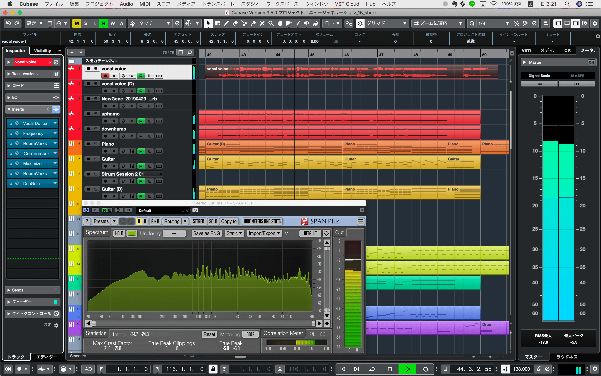

+++
authors = ["Beqqor"]
title = "[DAW] Cubaseについて"
date = "2020-04-25"
description = "Cubaseの紹介です。"
tags = [
    "DTM講座", "DAW", "DTM",
]
weight = 4
+++

## はじめに

このページでは， **Cubase** というDAWの詳細が記されています。

## Cubase    
[公式サイトはこちら](https://new.steinberg.net/ja/cubase/)

**価格**

※Gradeで変わります

- Elements 10.5 13200円
- Artist 10.5   31680円
- Pro 10.5      59180円

**備考**

- 体験版あり
- ProとArtistはUSB-eLicenserが必要(3520円・DAWに付属)
- アップデートが有料
- 一部DAWとのクロスグレードでの購入可(他のDAWをすでに持っている場合安く購入できます)
- 学割可
- Steinberg社(Cubaseの会社)の製品にAI(Elementsより弱い)がついてくる

**対応OS**

- Windows 10 (ver. 1809 / ver. 1903) 64-bit
- macOS Mojave (10.14) / Catalina (10.15)

## ユーザーの意見

**○as key_さん**

___

　Steinberg製の製品に付属していたAIを使っている。MIDIの変更を簡単なプログラミングのように操作できる **ロジカルプリセット** やコードをいい感じにおいてくれる **コードトラック** などの機能が便利で、Steinberg製の製品との連携がとれるのもよい。また多くの人が使っているため、 **疑問点があっても調べればすぐに解消できる。** ユーザーには **中田ヤスタカさん** などの著名な方も多い。

___

**○Beqqor(Ki-chan)※著者**

___

　どうも、AAR代表兼見習いのBeqqor(Ki-chan)と申します。ここでは、僕が普段使用しているDAW **「Cubase Pro 10」** について私感を語っていこうと思います。

１. **誰が使っている？**

　AAR内では、僕と[Zitrone君](https://twitter.com/Zitrone_AAR)などが使用しています。著名人では、Perfumeやきゃりーぱみゅぱみゅ氏などのプロデュースを行っている **中田ヤスタカ氏** 、God knows…や恋愛サーキュレーションなど数々の名アニソンを生み出した **神前 暁（こうさきさとる）氏** 、I’m so HappyやSecond HeavenなどBEMANIシリーズの楽曲を手がける **Ryu☆氏** などがCubaseを用いています。この他、どんな方がCubaseを用いているかは [こちらのインタビュー](https://japan.steinberg.net/jp/artists/steinberg_stories.html)から確認できますよ。

２. **グレード一覧**

　Cubaseには、**Elements・Artist・Pro** の３つのグレードが存在し、自分の予算・作曲のレベルに応じてグレードを選択することができます。また、Cubaseを開発しているSteinbergや親会社であるYAMAHAの周辺機器を購入すると付いてくる簡易版Cubase **「Cubase AI」** も存在します。各グレードがどのような機能の違いを持っているかは[こちらでご確認ください](https://new.steinberg.net/ja/cubase/compare-editions/?_sp=8a9c6517-a21c-434e-a892-81625510cd08.1586708162386&_ga=2.13153840.667292954.1586629144-490831868.1586629144)。

３. **Cubase Proのここがイイ/ダメ**

  a.ここがイイ！

  - 付属の **プラグイン** が充実
  - **コードトラック** が便利

  b.ここがダメ！

  - **費用** が他のDAWに比べて重い
  - **オートメーション** (後述)が扱いづらい

４.**詳細**

  ・付属のプラグインが充実

  　プラグインとは、簡単に言えば **「DAWの中で使用するソフト」** のことです。例えば、打ち込んだノートを演奏するための **シンセサイザー** や、出来上がった音を加工する **エフェクターター** などを指します。Cubase Proに付属するプラグインはかなり優秀なものが揃っていて、**いろいろ買い足さずともわりと楽曲制作を進めることができるのは大きいです。** 余談ですが、「Anti-Aging Record Vol.15」に収録されている拙作「Ceres」は付属の音源とフリーの音素材だけで最後まで完成させています。

  ・コードトラックが便利

  コード進行を決めてから楽曲を作る際に、**コードトラック** が重宝します。DAWの画面上に視覚的にコード進行を配置できるので、複雑なコード進行などを組んだ際などに **すぐコードを確認できるのは強みだと思っています。** また、コードトラックに入力したコードをMIDI（ノートの打ち込みに用いる形式）に変換してトラック（特定の楽器を鳴らすためのレーン）に貼り付けられる上、貼り付ける際の形式をギター（ギターでコードを鳴らす時の形）、ピアノ（ピアノでコードを鳴らす時の形）、ベーシックの三種類から選べるのも **打ち込みの手間を省く** いい機能だと思っています。

  ・費用が他のDAWに比べて重い

  ※2020年4月13日時点での値段です。参考：[https://new.steinberg.net/ja/cubase/](https://new.steinberg.net/ja/cubase/)

  現行で販売されているCubase Pro10.5は、**学割を適用しても41800円（税込）** とかなり値は張ります。また、**アップデートにも追加でお金がかかり、** 僕が使っているCubase Pro 10からアップデートを試みると7150円（税込）です。すでに他のDAWの紹介記事を読んだ方ならわかると思いますが、アップデートにお金がかかる点は少々苦しいかなと感じています。ただ、**大型アップデートのたびにプラグインが追加されたり値段相応の便利な機能がついてきたり** するので、新しいプラグインを買った…と考えるとそこまで大きい出費ではないのかもしれません。

  ・オートメーションが扱いづらい

  まずオートメーションとは、**ソフト上のパラメータ（つまみとかボタンとか）を入力した通りに動かしてくれる機能** です。Cubaseの **最大の欠点** はここだと思っていて、使い勝手がかなり悪いです。昔よりは改善されているみたいですが…。DTMの基本であるコピーアンドペーストがこの機能に関してはとてもやりづらく、繰り返して同じ動きをつけたい時に入力の手間が他のDAWに比べて多大にかかる印象があります。よく使う機能なだけに少し残念です…。

  以上、Cubaseの紹介記事でした！その他疑問点等は[僕のTwitterアカウント](https://twitter.com/mrcl_drm0224)宛にDMを送っていただけるとありがたいです！では！

___

**○Zitroneさん**
___

　USB-eLicencerを持ち運ぶ必要はあるが使い勝手はよい。

___

## 注釈

※記事内で多用されるものを再掲しております。

- プラグイン・・・DAWの上で動く様々なソフトのこと。
- オートメーション・・・曲の中で様々なパラメーターを自動で動かす機能。
- エフェクター・・・音を変化させるプラグイン。
- シンセサイザー(シンセ)・・・音を作ることのできるプラグイン。
