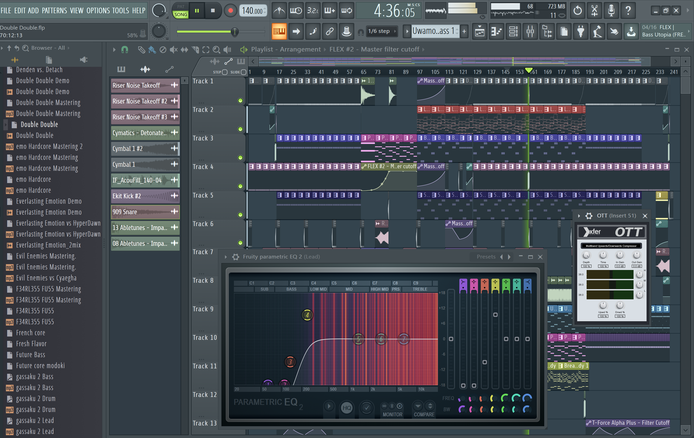

+++
authors = ["Beqqor"]
title = "[DAW] FL Studioについて"
date = "2020-04-25"
description = "FL Studioの紹介です。"
tags = [
    "DTM講座", "DAW", "DTM",
]
weight = 4
+++

### はじめに

このページでは， **FL Studio** というDAWの詳細が記されています。

## FL Studio  
[公式サイトはこちら](https://www.image-line.com/flstudio/)

**価格**

※Gradeで変わります

- Fruity Edition      $99.00 (10727.99円(4月11日 19:37 UTC現在・以下同じ))
- Producer Edition    $199.00(21564.34円)
- Signature Bundle    $299.00(32400.69円)
- All plugins Bundle  $899.00(97418.79円)

**備考**

- 体験版あり
- 一部DAWとのクロスグレードでの購入可(他のDAWをすでに持っている場合安く購入できます)

**対応OS**

- Windows 8.1, 10以降
- macOS   10.13.6以降

**ユーザーの意見**

**○acqua pazzaさん**
___

　比較的安め、ダンスミュージック向き、様々なアーティストが使っている、備え付けシンセやエフェクターが良い、リズム置きやすい、などなど
___

**○GEOさん**

___
　他のDAWと比べて、ループのリズムとかメロディーが作りやすく、EDMに特化しているところだと思います。
___

**○Bowneさん**
___
　FL Studioは個人的に使い慣れてるからこう思うのか分かりませんが、UIがシンプルで **どこを押すとどの画面が出てくるかの直感的操作がしやすくて取っ付きやすい** イメージがあります。  
　また、Signature Bundleにはみんな大好き ***Soundgoodizer(付属のエフェクター)*** やキモ音製造に一役買ってくれる **Vocodex(付属のエフェクター)**、幅広い音が作れる **Sytrus(付属のシンセサイザー)**……などなど付属のVSTが優秀なものが多くて **初期装備が充実した状態から始められる** のもいい点だと思います。  
　**アップデートが無料** で手軽にできるのも魅力的だと思います。  
　さらに、MKさんのチュートリアルが代表的ですが、**YouTube上にゴロゴロ分かりやすいチュートリアルが落ちてたりする** のも良いですね…。こんなの作りたいけどどうするんだろとかこういう音の作り込みをどう処理するんだろうとかが解決しやすいです。  
　後は世界トップDJの **Martin Garrix** や日本を代表するクラブミュージックトラックメイカー **Banvox** などといった名プロデューサー達が愛用してることもあり、充分に信頼できるDAWであることくらいですかね。  
___

**○hibaさん**
___
オートメーションが書きやすい。
___

**○北村緑さん**
___
FL-chanがかわいい。
___

## 注釈

※記事内で多用されるものを再掲しております。
- プラグイン・・・DAWの上で動く様々なソフトのこと。
- オートメーション・・・曲の中で様々なパラメーターを自動で動かす機能。
- エフェクター・・・音を変化させるプラグイン。
- シンセサイザー(シンセ)・・・音を作ることのできるプラグイン。
- FL-chan・・・FL Studioに付属のプラグイン。音楽に合わせて踊ってくれる。かわいい。
