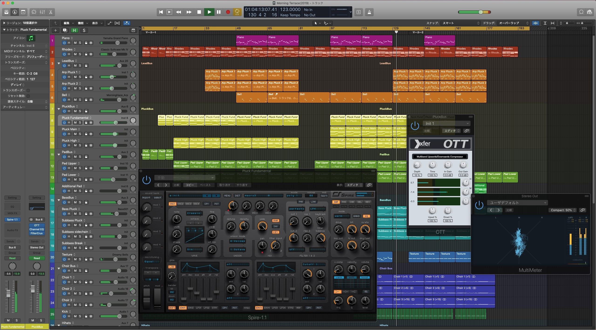

+++
authors = ["Beqqor"]
title = "[DAW] Logicについて"
date = "2020-04-25"
description = "Logicの紹介です。"
tags = [
    "DTM講座", "DAW", "DTM",
]
weight = 4
+++

## はじめに

このページでは， **Logic** というDAWの詳細が記されています。

## Logic Pro X  
[公式サイトはこちら](https://www.apple.com/jp/logic-pro/)

**価格**

- 24000円

**備考**

- 90日間無料
- 学割で22400円＆final cut pro(動画編集ソフト)が付属

**対応OS**

- macOS 10.13.6以降

## ユーザーの意見
**○2bnsnさん**  
___
　**完全版が安く、付属の音源の質もよい。** クラブミュージックから宅録まで幅広くカバーすることができる。
___

**○Nayaさん**  
___
　20000円前後でフルの機能が使える。
___
